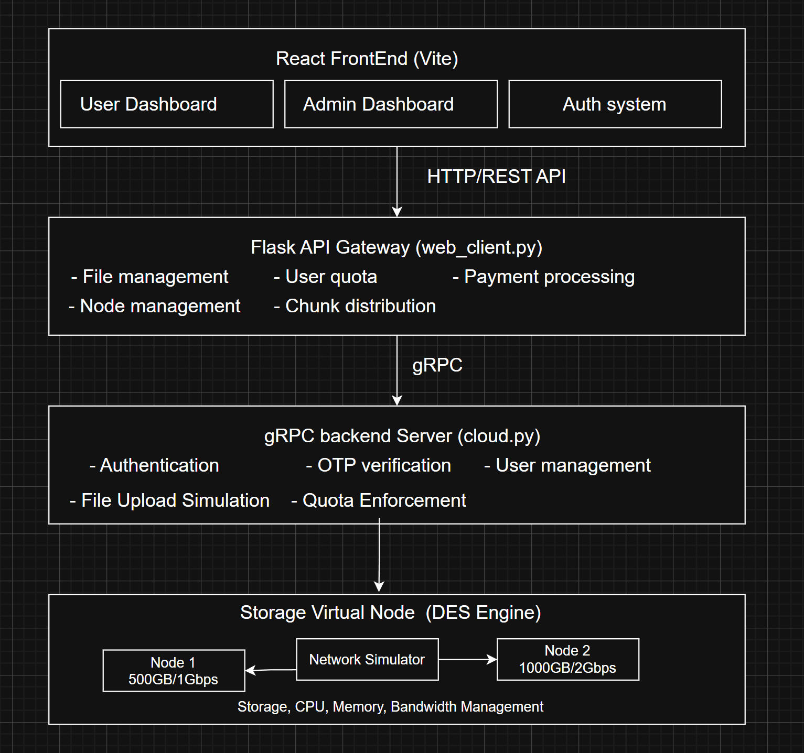

# 🌩️ GoLocal Storage  
A Distributed Cloud Storage Simulation System

GoLocal Storage is a lightweight simulation of a distributed cloud storage platform with multi-node virtual storage, chunk-based file distribution, OTP authentication, and a full user/admin interface. Designed for learning and demonstration of distributed system concepts.

---

## 📌 Table of Contents
- [Overview](#overview)
- [Key Features](#key-features)
- [System Architecture](#system-architecture)
- [Core Components](#core-components)
- [API Summary](#api-summary)
- [Storage Simulation Engine](#storage-simulation-engine)
- [Quick Start](#quick-start)

---

## 📝 Overview
This project simulates:
- User authentication with OTP  
- File uploads split into chunks  
- Distribution across virtual storage nodes  
- Quota enforcement & upgrade requests  
- Admin control for users, nodes, and payments  

---

## 🚀 Key Features

### **User Features**
- Email OTP signup & login  
- Upload files with progress tracking  
- Quota display & storage usage  
- Rename/delete files  
- Request storage upgrades  

### **Admin Features**
- View/manage users  
- Approve or reject payment/upgrade requests  
- Add, toggle, or remove nodes  
- View node stats (capacity, bandwidth, active status)

### **System Features**
- Adaptive chunking  
- Round-robin distribution  
- DES-based network simulation  
- REST (Flask) → gRPC → Simulation engine

---

## 🏗 System Architecture

### **Layers**
| Layer | Technology | Function |
|------|------------|----------|
| **Frontend** | React + Vite | UI, file mgmt, dashboards |
| **API Gateway** | Flask | REST API, state, gRPC proxy |
| **Backend** | Python gRPC | Auth, OTP, simulation |
| **Storage Network** | DES Engine | Nodes + transfers |



---

## 🎯 Core Components

### **Frontend**
- `App.jsx`, `Dashboard.jsx`, `AdminDashboard.jsx`
- Authentication, file uploads, admin tools

### **API Gateway (Flask)**
- gRPC bridge  
- File list, rename, delete  
- Node and payment management  

### **gRPC Backend**
- Password hashing (bcrypt)  
- OTP via email  
- Session token management  
- Quota checks + upload simulation  

---

## 🔌 API Summary

### **User Endpoints**
| Endpoint | Method | Description |
|----------|--------|-------------|
| `/api/get-user-files` | POST | User files |
| `/api/rename-file` | POST | Rename file |
| `/api/delete-file` | POST | Delete file |
| `/api/request-storage` | POST | Request upgrade |
| `/api/get-user-quota/<u>` | GET | Quota info |

### **Admin Endpoints**
| Endpoint | Method | Description |
|----------|--------|-------------|
| `/api/admin/get-users` | GET | List users |
| `/api/admin/get-nodes` | GET | Node stats |
| `/api/admin/add-node` | POST | Add node |
| `/api/admin/toggle-node` | POST | Activate/deactivate |
| `/api/admin/delete-node` | POST | Remove node |
| `/api/admin/get-payment-requests` | GET | Pending requests |
| `/api/admin/approve-payment` | POST | Approve |
| `/api/admin/reject-payment` | POST | Reject |

---

## 🧮 Storage Simulation Engine


### **Chunking Rules**
| File Size | Chunk Size |
|-----------|------------|
| ≤ 2MB | 512KB |
| ≤ 50MB | 2MB |
| > 50MB | 10MB |

### **Distribution**
- **Round-robin**: chunks rotate across active nodes  
- Nodes have:  
  - Capacity  
  - Bandwidth  
  - Active/inactive state  

### **DES Logic**
transfer_time = chunk_bits / bandwidth_bps
simulation_time += transfer_time

---

## ▶ Quick Start

### 1. Backend (gRPC)
```bash
python cloud.py
```

### 2. API Gateway (Flask)
```bash
python web_client.py
```

### 3. Frontend
```bash
npm install
npm run dev
```
